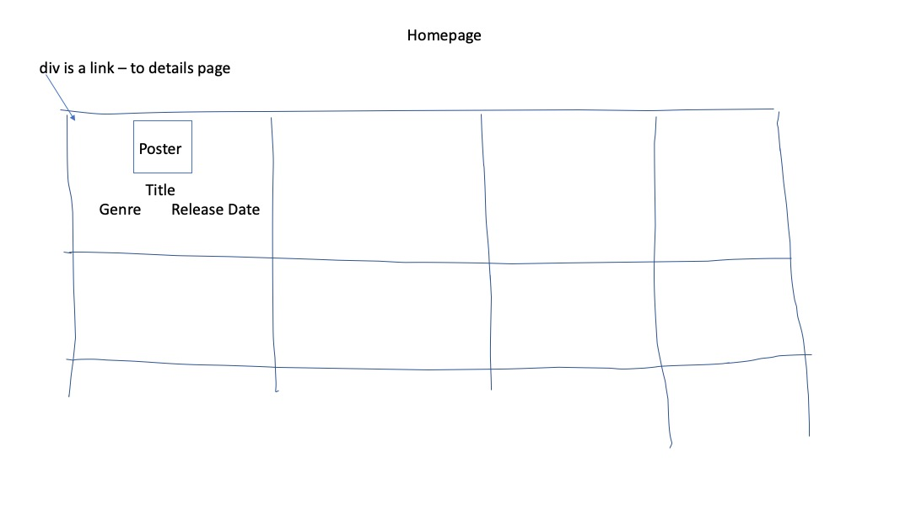
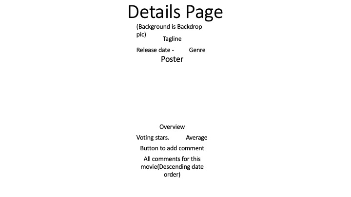

# The Movie List

## Implemented User Stories
- [x] Users can view latest theater releases on home page
- [x] Users can click on movie selection to view more details for that movie
- [x] Users can rate movies and see average ratings for movies
- [x] Users can comment on movies and see other user comments on movies and update and delete their comments
- [x] Users can view movie trailers in popup modal
- [x] Users can log in an out (auth0) to rate and comment
- [x] Users not logged in can view ratings, comments and details
- [x] Add favorite movies
- [x] Show favorite moves

## Additonal User Stories
- [] Allow users to search by genre
- [] Allow users to search by actor
- [] Allow users to search by release year
- [] Use dynamo backend instead of mongo
- [] Transition to React

## App Walkthrough GIF

Here's a walkthrough of implemented User Stories:

RecordIt created GIF's [External Link](https://recordit.co/K61PIGxF04).  
GIF created with [RecordIt](https://recordit.co).

## Wireframe

## License
MIT License

Copyright (c) 2022 TLGJavascriptProject

Permission is hereby granted, free of charge, to any person obtaining a copy
of this software and associated documentation files (the "Software"), to deal
in the Software without restriction, including without limitation the rights
to use, copy, modify, merge, publish, distribute, sublicense, and/or sell
copies of the Software, and to permit persons to whom the Software is
furnished to do so, subject to the following conditions:

The above copyright notice and this permission notice shall be included in all
copies or substantial portions of the Software.

THE SOFTWARE IS PROVIDED "AS IS", WITHOUT WARRANTY OF ANY KIND, EXPRESS OR
IMPLIED, INCLUDING BUT NOT LIMITED TO THE WARRANTIES OF MERCHANTABILITY,
FITNESS FOR A PARTICULAR PURPOSE AND NONINFRINGEMENT. IN NO EVENT SHALL THE
AUTHORS OR COPYRIGHT HOLDERS BE LIABLE FOR ANY CLAIM, DAMAGES OR OTHER
LIABILITY, WHETHER IN AN ACTION OF CONTRACT, TORT OR OTHERWISE, ARISING FROM,
OUT OF OR IN CONNECTION WITH THE SOFTWARE OR THE USE OR OTHER DEALINGS IN THE
SOFTWARE.
